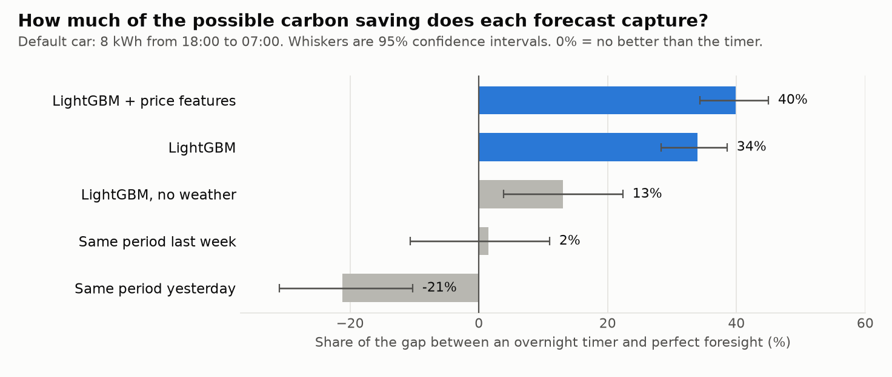
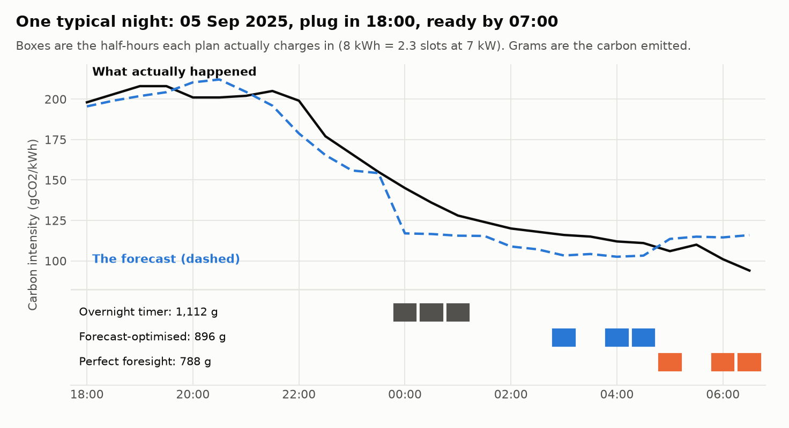
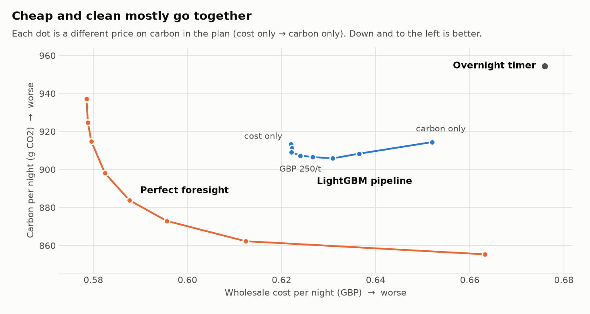

# GB carbon intensity: day-ahead forecasting for EV charging

Forecast half-hourly GB grid carbon intensity a day ahead, use the forecast to schedule
an EV charge, and measure how much emissions saving it captures compared with simple
baselines.

**Layer 1: carbon intensity end to end. Layer 2: wholesale prices**, a realised-price forecast, and a cost/carbon trade-off in the charging optimiser.

Read the story first: [`WRITEUP.md`](WRITEUP.md). Full results: [`reports/RESULTS.md`](reports/RESULTS.md) (regenerated by `carbon-charge report`).
Data problems found along the way: [`DATA_ISSUES.md`](DATA_ISSUES.md).

## The question

A car plugs in at 18:00 and needs 8 kWh by 07:00 from a 7 kW charger. Four strategies:

1. **Charge on arrival**
2. **Overnight timer**, from 00:00
3. **Forecast-optimised**: fill the slots the day-ahead forecast says are greenest
4. **Perfect foresight**: fill the slots that turn out to be greenest

Headline metric: the share of the gap between the timer and perfect foresight that the
forecast-optimised strategy captures. Also reported: MAE/RMSE by season and time of day,
slot-ranking accuracy, and a sensitivity set (plug-in 17:00-21:00, 4-20 kWh, not every night).

## What the results say (backtest 2025-01-01 to 2026-09-29, generated 2026-09-30)

Full tables, with confidence intervals and sensitivity, are in [`reports/RESULTS.md`](reports/RESULTS.md).





- **Carbon:** LightGBM's error is 19 gCO2/kWh MAE against 43 for same-period-yesterday. Charging with its forecast
  captures **34%** of the gap between an overnight timer and perfect foresight (40% with price features added).
  The absolute prize is small: perfect foresight saves 10% of emissions over the timer.
- **Price:** the day-ahead auction result is public before the 11:00 cutoff, so it is a known input. The realised
  (Market Index) price differs from it by about £12/MWh MAE, and **the LightGBM price model does not beat using the
  day-ahead price directly** (12.22 vs 12.27). Cost-only charging captures about 55% of its gap either way.
- **Trade-off:** planning on price alone cuts carbon about as much as planning on the carbon forecast, and blending
  a modest carbon price (about £250/t) into the objective costs almost nothing.



## How it avoids leaking the future

The forecast for day D is issued at **11:00 UK time on D-1**. Every feature value is stored
with the time it was published, and anything not available by the cutoff is set to missing:

- Carbon intensity actuals count as available 1 h after their period ends, so "same period
  yesterday" is only known for the first ~10 hours of the day and falls back to D-2 after that.
- Weather is an archive of forecasts as issued (Open-Meteo Previous Runs, ECMWF), never
  observed weather. Only the 2-day-old forecast is used; the 1-day-old one is published too late
  for most hours of D.
- The NESO day-ahead demand forecast is used only if published before the cutoff.
- The N2EX day-ahead price for day D counts as published at 10:00 UTC on D-1; realised Market Index prices count 1 h after their period ends. Next-hour day-ahead prices that belong to D+1 are masked.
- Actual demand is never read. The label is never a feature.
- Backtests are rolling-origin (refit every 14 days, training strictly before the fold).
  No random splits. LightGBM needs no scaling, so nothing is fitted on test data.

`tests/test_features_leakage.py` checks all of this, including by corrupting every value
published after the cutoff and asserting the features do not move.

## Quick start

```bash
uv sync                                  # Python 3.11+
uv run carbon-charge ingest all          # carbon intensity, demand forecast, weather -> data/carbon.duckdb
uv run carbon-charge backtest            # rolling-origin backtest (~10 min)
uv run carbon-charge report              # metrics, optimiser results, reports/RESULTS.md
uv run pytest
```

With Docker:

```bash
docker compose run --rm app ingest all
docker compose run --rm app backtest
docker compose run --rm app report
docker compose --profile test run --rm tests
```

**macOS:** LightGBM needs the OpenMP runtime: `brew install libomp`.

## Commands

| Command | What it does |
|---|---|
| `ingest carbon / demand / weather / prices / wind / all` | Pull source data into DuckDB |
| `log-forecast [--out-dir DIR]` | Snapshot NESO's forward forecast with its issue time |
| `import-forecasts DIR` | Load logger CSVs (a checkout of the `data` branch) into DuckDB |
| `backtest` | Rolling-origin backtest of the carbon and price models; stores out-of-sample forecasts |
| `evaluate` | MAE/RMSE by season and time of day, slot-ranking accuracy |
| `optimise` | Four charging strategies over the backtest: carbon, cost-only and the cost/carbon frontier, incl. sensitivity set |
| `report` | evaluate + optimise + write `reports/RESULTS.md` and the charts |
| `experiment` | Pre-declared model variants (wind forecast, night-ordering target) scored on night ordering, with paired comparisons |
| `log-wind --out-dir DIR` / `import-wind DIR` | Snapshot NESO's live day-ahead wind forecast, and load snapshots into DuckDB |
| `status` | Row counts and coverage per table |

## NESO's own forecast as a baseline

The Carbon Intensity API's historical `forecast` field is **not** day-ahead (its error is a
quarter of same-period-yesterday's; see `DATA_ISSUES.md` CI-1). So a scheduled GitHub Actions
workflow (`.github/workflows/log-forecast.yml`, daily 07:30 UTC) records the forward forecast as
issued and commits it as CSV to the `data` branch. To use it:

```bash
git fetch origin data && git worktree add ../gb-carbon-data data
uv run carbon-charge import-forecasts ../gb-carbon-data/ci_forecast
uv run carbon-charge report        # NESO row appears once enough nights are logged
```

## Layout

```
src/carbon_charge/
  ingest/       NESO carbon intensity, NESO demand forecast, Open-Meteo weather, N2EX + Elexon prices, forecast logger
  features/     availability.py (publication lags, cutoff)  build.py (leak-free feature matrix)
  models/       baselines.py, lgbm.py
  evaluation/   backtest.py, metrics.py, ranking.py
  charging/     scenarios.py, strategies.py, value.py (carbon gap), blend.py (cost + lam x carbon)
  timeutils.py  UTC <-> settlement date/period (46/50-period clock-change days)
  db.py, config.py, report.py, cli.py
tests/          clock changes, leakage, optimiser correctness, backtest, metrics
```

Storage is DuckDB; every row is keyed on a UTC timestamp with settlement date and period alongside,
and every forecast keeps its issue time.
