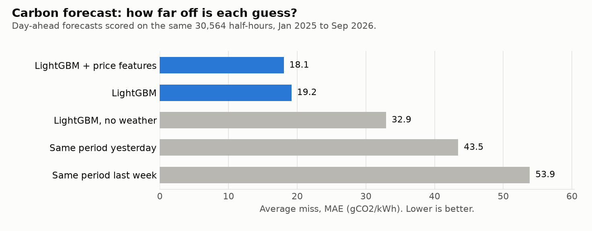
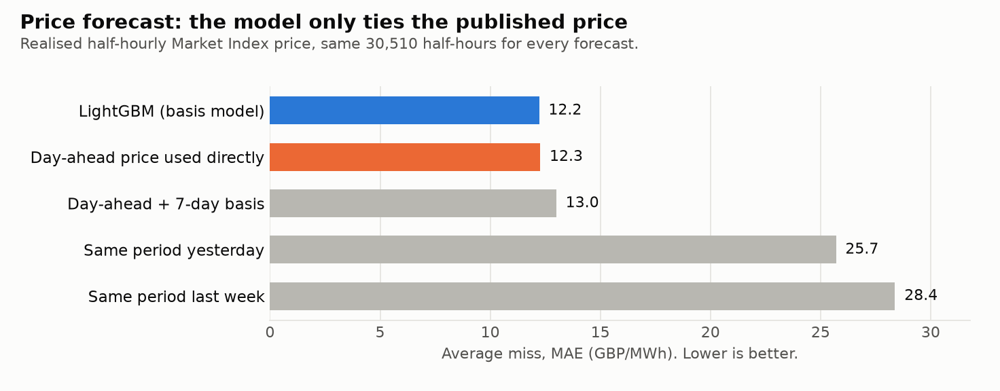

# Layer 1 results: day-ahead GB carbon intensity and EV charging

_Generated by `carbon-charge report`; do not edit by hand._

Test period: **2025-01-01 to 2026-09-29**, 637 days and 636 charging nights, using a rolling origin with 46 folds (model refit every 14 days). Every forecast for day D uses only data published before 11:00 UK time on D-1.

Night counts differ between analyses because each keeps only nights where every compared forecast is complete. The headline comparison uses 631 of 636 nights: a lagged baseline has no value for periods that do not exist on a clock-change day (`DATA_ISSUES.md` X-5). The cost comparison in Layer 2 uses fewer, for the same reason plus missing realised prices.

## Headline: share of the timer-to-perfect-foresight gap captured

Default car: plug in 18:00, 8 kWh by 07:00, 7 kW charger, every night (631 nights). Emissions are priced at actual carbon intensity. 'Gap captured' = (timer − strategy) / (timer − perfect foresight), totalled over nights; the CI is a 7-night moving-block bootstrap.

| Strategy | Nights | gCO2 per night | Saving vs timer (%) | Gap captured (95% CI) |
|---|---|---|---|---|
| Charge on arrival | 631 | 1244.9 | -30.7 | -294% |
| Overnight timer (00:00) | 631 | 952.8 | 0.0 | 0% |
| Forecast-optimised (LightGBM) | 631 | 919.1 | 3.5 | 34% (28 to 39%) |
| Forecast-optimised (LightGBM without weather) | 631 | 939.8 | 1.4 | 13% (4 to 22%) |
| Forecast-optimised (LightGBM + price features) | 631 | 913.2 | 4.2 | 40% (34 to 45%) |
| Forecast-optimised (Same period yesterday*) | 631 | 973.9 | -2.2 | -21% (-31 to -10%) |
| Forecast-optimised (Same period last week) | 631 | 951.3 | 0.2 | 2% (-11 to 11%) |
| Perfect foresight | 631 | 853.5 | 10.4 | 100% |

## Forecast accuracy (MAE / RMSE, gCO2/kWh)

All models scored on exactly the same half-hours.

| Model | Half-hours | MAE | RMSE |
|---|---|---|---|
| Same period last week | 30564 | 53.87 | 68.36 |
| LightGBM | 30564 | 19.17 | 24.7 |
| LightGBM without weather | 30564 | 32.94 | 41.21 |
| LightGBM + price features | 30564 | 18.05 | 23.37 |
| Same period yesterday* | 30564 | 43.45 | 55.95 |

### By season

| season | LightGBM | LightGBM without weather | LightGBM + price features | Same period yesterday* | Same period last week |
|---|---|---|---|---|---|
| DJF | 18.4 / 23.2 | 36.0 / 44.4 | 18.3 / 23.1 | 47.4 / 60.8 | 62.9 / 77.9 |
| JJA | 19.1 / 24.8 | 26.7 / 33.4 | 18.3 / 23.9 | 37.8 / 48.2 | 42.7 / 54.6 |
| MAM | 18.7 / 23.8 | 33.0 / 41.4 | 17.6 / 22.7 | 44.7 / 57.1 | 52.4 / 65.6 |
| SON | 21.0 / 27.6 | 38.6 / 47.2 | 18.0 / 23.9 | 45.2 / 59.0 | 62.0 / 78.1 |

### By time of day (UK local, 4-hour blocks)

| tod_block | LightGBM | LightGBM without weather | LightGBM + price features | Same period yesterday* | Same period last week |
|---|---|---|---|---|---|
| 00-04 | 20.1 / 26.1 | 31.6 / 39.2 | 19.0 / 24.6 | 38.8 / 50.8 | 55.4 / 70.8 |
| 04-08 | 20.7 / 26.4 | 33.3 / 41.4 | 19.0 / 24.6 | 42.2 / 54.5 | 57.7 / 72.6 |
| 08-12 | 18.9 / 24.6 | 31.6 / 39.7 | 17.9 / 23.5 | 40.9 / 52.8 | 51.8 / 65.2 |
| 12-16 | 17.2 / 22.7 | 30.2 / 38.4 | 16.4 / 21.3 | 41.1 / 53.3 | 48.6 / 62.4 |
| 16-20 | 17.9 / 22.5 | 34.8 / 43.2 | 16.9 / 21.4 | 47.5 / 59.9 | 52.7 / 66.3 |
| 20-24 | 20.3 / 25.6 | 36.3 / 45.0 | 19.2 / 24.7 | 50.2 / 63.4 | 57.0 / 72.2 |

## Slot-ranking accuracy in the charging window (18:00-07:00)

Overlap between the k slots the forecast ranks greenest and the k actually greenest. k=3 is the number of slots the default car needs.

| Forecast | Greenest 3 slots | Greenest 6 slots |
|---|---|---|
| LightGBM | 25% | 46% |
| LightGBM + price features | 30% | 48% |
| LightGBM without weather | 22% | 39% |
| Random choice | 12% | 23% |
| Same period last week | 21% | 37% |
| Same period yesterday* | 20% | 32% |

## Sensitivity: gap captured by scenario

One-at-a-time variations around the default car.

| Scenario | LightGBM | Yesterday* | Last week |
|---|---|---|---|
| default | 34% | -21% | 2% |
| plug_in_17:00 | 41% | -9% | 5% |
| plug_in_19:00 | 34% | -21% | 3% |
| plug_in_20:00 | 35% | -19% | 4% |
| plug_in_21:00 | 35% | -17% | 7% |
| energy_4kWh | 39% | -8% | 7% |
| energy_12kWh | 31% | -37% | -5% |
| energy_16kWh | 28% | -56% | -15% |
| energy_20kWh | 24% | -81% | -27% |
| mon_wed_fri_only | 36% | -22% | 6% |

## Notes and caveats

- \*'Same period yesterday' obeys the cutoff: at 11:00 on D-1 only the first part of D-1 is published, so periods after ~09:30 fall back to the same period on D-2. About 58% of periods use the fallback.
- **NESO's forecast is not scored yet.** Its historical `forecast` field is not day-ahead (`DATA_ISSUES.md` CI-1), so the baseline comes from the daily logger, which only started on 2026-09-30. Rerun `carbon-charge report` after the logger has accumulated a few weeks of snapshots.
- `metrics_reference_neso_latest_revision.csv` scores that non-day-ahead field for context only; it is not a valid baseline.
- Weather features exist only from 2024-03-07 (`DATA_ISSUES.md` WX-3), so early folds train on little weather data.
- The optimiser plans each half-hour with the forecast for its own settlement day (issued 11:00 on the day before that day).
- Publication lags for carbon intensity actuals (1 h) and ECMWF runs (8 h) are assumptions; see `DATA_ISSUES.md` X-1, WX-2.

# Layer 2: wholesale prices

The price being forecast is the **realised Elexon Market Index (APX) price**, half-hourly. The N2EX day-ahead auction price for day D is published by 10:00 GMT on D-1, before the 11:00 UK cutoff, so it is known when planning and is used as a feature and as the natural baseline. The LightGBM price model predicts the *basis* (realised minus day-ahead) and adds it back.

## Price forecast accuracy (MAE / RMSE, GBP/MWh)

All models scored on exactly the same half-hours.

| Model | Half-hours | MAE | RMSE |
|---|---|---|---|
| Day-ahead price as forecast | 30510 | 12.27 | 24.95 |
| Day-ahead + 7-day basis | 30510 | 13.0 | 25.57 |
| Same period last week | 30510 | 28.38 | 48.2 |
| LightGBM (basis model) | 30510 | 12.22 | 24.64 |
| Same period yesterday* | 30510 | 25.7 | 45.76 |

### By season

| season | LightGBM (basis model) | Day-ahead price as forecast | Day-ahead + 7-day basis | Same period yesterday* | Same period last week |
|---|---|---|---|---|---|
| DJF | 11.5 / 38.3 | 11.8 / 39.2 | 13.2 / 40.0 | 20.4 / 57.0 | 24.2 / 60.0 |
| JJA | 12.6 / 19.7 | 12.5 / 19.6 | 13.1 / 20.1 | 26.4 / 41.6 | 28.5 / 43.1 |
| MAM | 12.4 / 17.5 | 12.3 / 17.5 | 12.9 / 18.1 | 26.3 / 38.5 | 27.5 / 39.5 |
| SON | 12.3 / 18.3 | 12.4 / 18.4 | 12.8 / 18.9 | 30.3 / 46.4 | 34.7 / 51.1 |

### By time of day (UK local, 4-hour blocks)

| tod_block | LightGBM (basis model) | Day-ahead price as forecast | Day-ahead + 7-day basis | Same period yesterday* | Same period last week |
|---|---|---|---|---|---|
| 00-04 | 9.6 / 13.4 | 9.3 / 13.2 | 9.9 / 13.8 | 19.8 / 30.0 | 24.7 / 36.3 |
| 04-08 | 11.3 / 15.6 | 11.4 / 15.7 | 12.0 / 16.2 | 23.1 / 34.4 | 26.4 / 38.0 |
| 08-12 | 12.6 / 18.9 | 12.6 / 19.1 | 13.3 / 20.1 | 30.8 / 46.0 | 33.2 / 48.6 |
| 12-16 | 15.1 / 27.9 | 15.0 / 27.4 | 15.8 / 28.4 | 34.5 / 57.0 | 36.8 / 59.7 |
| 16-20 | 15.0 / 42.5 | 15.4 / 43.8 | 16.2 / 44.3 | 27.0 / 63.8 | 28.7 / 64.4 |
| 20-24 | 9.7 / 16.4 | 9.8 / 16.5 | 10.7 / 17.3 | 18.9 / 32.1 | 20.5 / 32.9 |

### Cheapest-slot ranking in the charging window (18:00-07:00)

| Forecast | Cheapest 3 slots | Cheapest 6 slots |
|---|---|---|
| Day-ahead + 7-day basis | 32% | 57% |
| Day-ahead price as forecast | 32% | 57% |
| LightGBM (basis model) | 34% | 56% |
| Random choice | 12% | 23% |
| Same period last week | 25% | 44% |
| Same period yesterday* | 22% | 39% |

## Does price information help the carbon forecast?

Adding day-ahead and realised-price features to the carbon model changes its MAE from 19.17 to 18.05 gCO2/kWh (see the Layer 1 table for both, on the same half-hours).

## Cost-only charging: share of the timer-to-perfect-foresight gap captured

Default car (18:00, 8 kWh by 07:00, 7 kW). Cost is wholesale only: energy priced at the realised Market Index price, with no network charges, levies or supplier margin. Negative prices count as negative cost.

| Strategy | Nights | Wholesale cost per night (GBP) | Saving vs timer (%) | Gap captured (95% CI) |
|---|---|---|---|---|
| Charge on arrival | 627 | 0.934 | -38.1 | -265% |
| Overnight timer (00:00) | 627 | 0.676 | 0.0 | 0% |
| Forecast-optimised: last week's carbon and price | 627 | 0.647 | 4.3 | 30% (21 to 36%) |
| Forecast-optimised: LightGBM carbon + known day-ahead price | 627 | 0.621 | 8.1 | 56% (51 to 61%) |
| Forecast-optimised: LightGBM carbon + day-ahead + 7-day basis | 627 | 0.622 | 7.9 | 55% (49 to 60%) |
| Forecast-optimised: LightGBM carbon + LightGBM price | 627 | 0.622 | 8.0 | 55% (50 to 60%) |
| Perfect foresight | 627 | 0.579 | 14.4 | 100% |

## Cost/carbon trade-off

Each slot is ranked by `price/1000 + lam x carbon/1e6` (GBP/kWh), where lam is a carbon price in GBP per tonne. Cells show realised wholesale cost per night (GBP) / carbon per night (g). 'Gap captured' is measured on that blended objective.

| Carbon price | Timer (GBP / g) | LightGBM pipeline (GBP / g) | Perfect foresight (GBP / g) | Gap captured: LightGBM | Gap captured: day-ahead price |
|---|---|---|---|---|---|
| cost only | 0.676 / 955 | 0.622 / 913 | 0.579 / 937 | 55% | 56% |
| GBP 50/t | 0.676 / 955 | 0.622 / 911 | 0.579 / 925 | 57% | 59% |
| GBP 100/t | 0.676 / 955 | 0.622 / 909 | 0.580 / 915 | 58% | 61% |
| GBP 250/t | 0.676 / 955 | 0.624 / 907 | 0.582 / 898 | 59% | 61% |
| GBP 500/t | 0.676 / 955 | 0.627 / 907 | 0.588 / 884 | 59% | 62% |
| GBP 1000/t | 0.676 / 955 | 0.631 / 906 | 0.596 / 873 | 58% | 59% |
| GBP 2500/t | 0.676 / 955 | 0.637 / 908 | 0.612 / 862 | 53% | 55% |
| carbon only | 0.676 / 955 | 0.652 / 914 | 0.663 / 855 | 40% | 40% |

## Cost-only sensitivity: gap captured by scenario

| Scenario | LightGBM price | Day-ahead price | Day-ahead + basis | Last week |
|---|---|---|---|---|
| default | 55% | 56% | 55% | 30% |
| plug_in_17:00 | 54% | 55% | 54% | 19% |
| plug_in_19:00 | 56% | 57% | 56% | 32% |
| plug_in_20:00 | 56% | 57% | 56% | 33% |
| plug_in_21:00 | 56% | 57% | 56% | 33% |
| energy_4kWh | 54% | 51% | 49% | 28% |
| energy_12kWh | 56% | 58% | 56% | 28% |
| energy_16kWh | 55% | 57% | 56% | 23% |
| energy_20kWh | 54% | 56% | 55% | 18% |
| mon_wed_fri_only | 57% | 57% | 55% | 34% |

## Layer 2 caveats

- Realised cost uses the Market Index price. A real supplier tariff differs (fixed shape, standing charges, network costs).
- Market Index prices are published after each period; they are usable as lags only once the period has ended plus a 1 h assumed lag (`DATA_ISSUES.md` X-4, PX-7).
- The day-ahead publication time (10:00 UTC on D-1) is an assumption; in winter it is an hour before the cutoff, in summer exactly at it (PX-3).
- 38 half-hours with no traded volume have no realised price and are excluded from training and scoring (PX-4).
